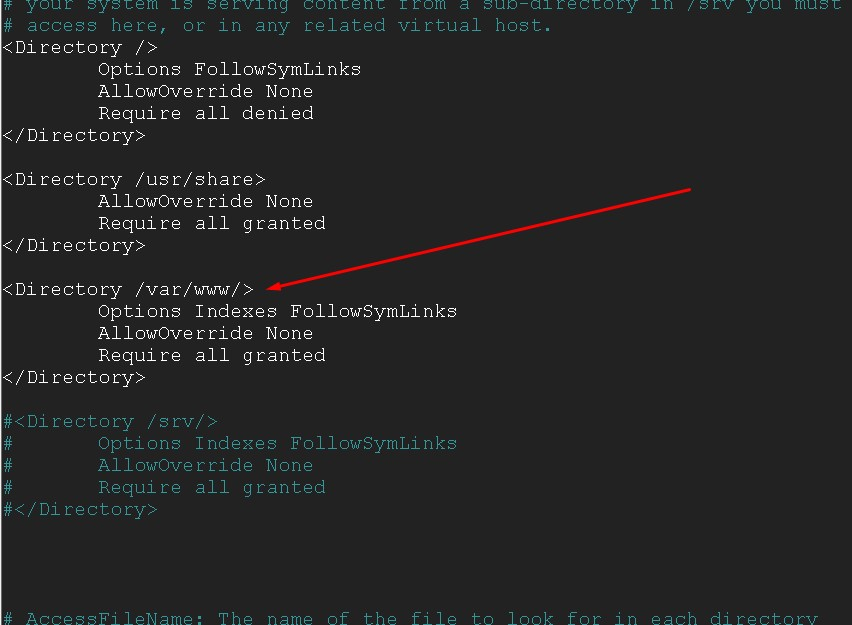
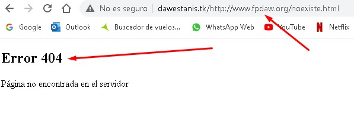

## REVISIÓN DE LA CONFIGURACIÓN BÁSICA DE APACHE
### En este proyecto analizaremos los principales ficheros de configuración y el valor de algunas directivas del servidor web `Apache2.4` instalado en la máquina `servidor_nombre`. Después, realizaremos varias pruebas de configuración sobre ese servidor web.

Partiremos de la configuración de red que sigue. Si no la tienes así, realiza los cambios pertinentes para que se cumpla, o indica en tu informe de prácticas la configuración de red con la que realizaste la práctica. Aconsejo la primera opción.

- Máquina `cliente_nombre (ejemplo: cliente_antonio) : Red interna con ip 10.70.XX.10`
- Máquina `servidor_Nombre (ejemplo: servidor_antonio): Red interna con ip10.70.XX.11` - Red puente con DHCP
- Las máquinas deben tener tu nombre como sombre de usuario ( cliente_nombre , cliente_servidor).
- En cada una de las capturas de pantalla del terminal debe aparecer evidencia de que se trata de tu máquina a través del nombre.
- En cada uno de los puntos que se pide, a parte de insertar una captura de pantalla hay que explicar detenidamente que pasos se han seguido y el significado de la captura de pantalla, en caso contrario no tendrá validez
### Ficheros de configuración.

- Inicia sesión con un usuario con privilegios de administrador en servidor_nombre.
- Abre un terminal y accede al directorio /etc/apache2.
- Haz un listado del directorio y observa los ficheros de configuración. CAPTURA DE PANTALLA

- Abre el fichero /etc/apache2/apache2.conf y analiza su configuración. Observa que incluye con la directiva include a otros ficheros y directorios. CAPTURA DE PANTALLA

#### 1. Servidor virtual por defecto.

- Accede al directorio /etc/apache2/sites-available y comprueba que está creado archivo 000-default.conf que contiene la configuración del servidor virtual por defecto. CAPTURA DE PANTALLA

- Accede a /etc/apache2/sites-enabled y comprueba que existe el fichero 000-default.conf que es un enlace simbólico a000-default.conf pero de /etc/apache2/sites-available.

#### 2. Directivas.

 #### - Cosulta el fichero /etc/apache2/apache2.conf y comprueba cuál es el valor de las siguientes directivas, explicando que función tiene cada una de ellas.

- ServerRoot CAPTURA DE PANTALLA

    

- Timeout CAPTURA DE PANTALLA

    

- KeepAlive CAPTURA DE PANTALLA

    

- MaxKeepAliveRequests CAPTURA DE PANTALLA

    

- KeepAliveTimeout CAPTURA DE PANTALLA

    

- User y Group CAPTURA DE PANTALLA

    

- ErrorLog CAPTURA DE PANTALLA

   

#### - Consulta la documentación de Apache y responde entonces a las siguientes preguntas.

- ¿Se permiten conexiones persistentes. ¿Qué directiva define este comportamiento?
    >KeepAlive

    >Esta directiva se utiliza para indicar si se activarán las conexiones persistentes; es decir. el poder hacer más de una petición por conexión.

    >Por ejemplo, supongamos que hacemos una petición al servidor de una página web que contiene tres imágenes, entonces tendremos que hacer 4 peticiones, una para la página y una por cada imagen. El tener activadas las conexiones persistentes nos permite el poder hacer todas las peticiones a través de la misma conexión, y no tener que negociar nuevas conexiones. La respuesta del servidor será más rápida y tendremos un mejor rendimiento.
- ¿Cuál es el fichero de errores?. ¿Qué directiva lo define?.
    >ErrorLog

    >Especifica la ubicación del fichero que contiene el registro de errores. Por defecto en la carpeta logs. Esta directiva sólo se puede encontrar fuera de cualquier sección.

#### - Consulta el fichero /etc/apache2/ports.conf, y comprueba cuál es el puerto en el que escucha las peticiones Apache. ¿En qué puerto escuchará también si se habilita el módulo modssl?. CAPTURA DE PANTALLA

#### - Consulta el fichero /etc/apache2/sites-avalaible/000-default.conf observa y comenta la función de cada uno de los siguientes puntos:

- Dentro de la directiva <VirtualHost>... </VirtualHost> se define el comportamiento del servidor virtual por defecto.
- El valor de la directiva DocumentRoot es /var/www/html.
- El valor de la directiva ErrorLog.
#### - Consulta el fichero /etc/apache2/apache2.conf observa y comenta la función de cada uno de los siguientes puntos:
- La directiva contenedora <Directory> .... </Directory> que se utiliza para determinar cómo Apache sirve el contenido del directorio/var/www.
- Realiza una captura de ese fichero y señala en él la directiva que se sigue.

    

## CONFIGURACIÓN BÁSICA DE APACHE 
Ahora realizaremos varias pruebas de configuración sobre el servidor web Apache instalado en la máquina `servidor_nombre`.

#### 1. Para ello vamos a crear dos archivos de configuración `fp.conf` que hará referencia a la web alojada en la ruta `/var/www/fp/`.

#### 2. Crear los siguientes directorios y archivos:

 +  `/var/www/fp/index.html`
 +  `/var/www/fp/ciclos/listado.html`
 +  `/var/www/fp/ciclos/examenes/`
 +  `/var/www/fp/ciclos/asir/asir.html`
 +  `/var/www/fp/ciclos/daw/daw.html`
 +  `/var/www/fp/ciclos/dam/dam.html`

    
#### 3. Configura la máquina `cliente_nombre` de forma que podamos acceder al contenido de nuestra web al poner en el navegador www.fpdaw.orgyfpdaw.org. Explica como lo has echo incluyendo capturas de pantalla.
>Nos dirigimos al fichero de configuración que se encuentra en la ruta /etc/apache2/sites-available y luego ejecutamos el siguiente comando `sudo nano 000-default.conf` 
>Una vez dentro establecemos html como documento root. Tras esto podemos editar el documento elegido como gustemos para que sea mostrado como pagina de inicio.

#### 4. Ficheros a servir por defecto (Directory Index).

- Desde cliente_nombre abre un navegador y establece una conexión a http://10.70.XX.11

    
- No se ha solicitado ningún recurso en concreto por lo que el servidor ha enviado el index.html (valor en la directiva DirectoryIndex por defecto). CAPTURA DE PANTALLA

    >Tomar en cuenta la misma captura de arriba.
- Renombra el fichero /var/www/fp/index.html a /var/www/fp/indice.html

    
- Desde cliente_nombre abre un navegador y establece una conexión a http://10.70.XX.11. ¿Qué ocurre ahora? ¿Ha cambiado lo que envía el servidor?. CAPTURA DE PANTALLA
    >Si, al cambiar el nombre del index.html el servidor no sabe cual tiene mostrar ya que por defecto se llama asi, por tanto nos muestra toda la carpeta.
    
- Edita el fichero /etc/apache2/apache2.conf y añade la siguiente directiva: DirectoryIndex listado.html en la sección<Directory /var/www>. Explica que conseguimos al hacer esta modificación CAPTURA DE PANTALLA

    
- Desde cliente_nombre abre un navegador y establece una conexión al servidor de nuevo. ¿Ha cambiado el fichero de carga?.CAPTURA DE PANTALLA

    >Si, ahora se muestra el Listado.html

#### 5. Páginas de error personalizadas.

- Configura el servidor para que cuando retorne el código de error 404 (página no encontrada) envíe el texto Página no encontrada en el servidor.

    
- Reinicia el servidor. Desde el cliente_nombre establece una conexión a http://www.fpdaw.org/noexiste.html y muestra qué te aparece en la pantalla.

    
#### 6. Redirecciones.

- Configura el servidor para que al entrar a http://www.fpdaw.org/ciclos haga una redirección automática hacia http://www.fpdaw.org/dam mostrando la página web correspondiente a DAM.

    

    
#### 7. Alias.

- Crea un aliasde forma que forma que al entrar en http://www.fpdaw.org/logosmuestre el contenido de los logotipos alojados en la ruta/home/usuarios/Documentos

    
#### 8. Autenticación

- Configura el servidor creando dos grupos de usuarios suiguientes: + 
    - alumnos :formado por alumno1 y alumno2 
    - profesores. formado por profesor1 y profesor2
Los profesores deben poder acceder a todo el site, mientras que los alumnos tienen el acceso restringido a la carpeta /fp/ciclos/examenes.

    

    

#### 9. Configuración de HTTPS

- Configura el uso de HTTPS en el servidor web. Explica detalladamente todo el proceso aportando capturas de pantalla.

    
- Redirecciona todo el tráfico HTTP hacia HTTPS, de forma que al conectar con http://www.fpdaw.org nos redireccione haciahttps://www.fpdaw.org.

    

    

    

### A continuación te adjunto el enlace a mi web para posibles comprovaciones.
`https://dawestanis.tk/`

    