###Tarea 1_1 - Trabajando con Git y MarkDown
Para la entrega de esta y las sucesivas tareas/prácticas que hagamos 
durante el curso haremos uso de GitHub, deberán enviarme a través de 
Campus el enlace a la práctica así como el commit que indique la fecha 
de entrega. Este commit debe reflejar una fecha que se encuentre dentro 
del plazo establecido para la realización de la práctica marcado a 
través de la plataforma Campus, en caso contrario se dará por suspendida 
la práctica.

####Para la creación del respositorio de git se han realizado los siguientes comandos:
- git config --global user.name "Estanis" 
> con este registramos el nombre de usuario.
- git config --global user.email "dawestanis@gmail.com" 
> con este registramos el correo electronico.
- git init dpl_B_estanis 
> de esta manera creamos el nuevo repositorio. Posteriormente crearemos el archivo README.md y LICENSE. Esto lo realizamos entrando al directorio del respositorio mediante cd dpl_B_estanis y luego touch README.md, etc. Adicionalmente, y usando un procedimiento similar, creamos dos directorios, practicas y tareas, mediante el comando mkdir tareas y mkdir practicas.
- git clone [https://github.com/dawestanis/dpl_B_estanis.git] 
> de esta manera procedemos a clonar nuestro repositorio.
- touch tarea1.md 
> creamos el archivo tarea1.md 
- git add . 
> añadimos todos los cambios que hemos hecho
- git commit -m "[comentario]"
> realizamos el primer commit 
- git push
> realizamos el primer push, de esta manera enviamos todos los cambios al repositorio.
- mkdir privada
> creamos la carpeta llamada privada
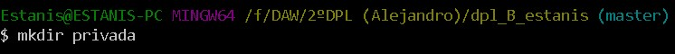
- touch privado.txt
> creamos el archivo privado.txt
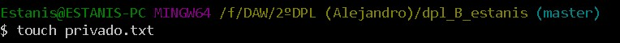
- nano .gitignore
> creamos el documento .gitignore y dentro insertamos privado.txt y la carpeta privada.
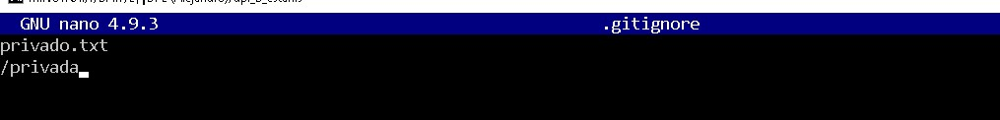
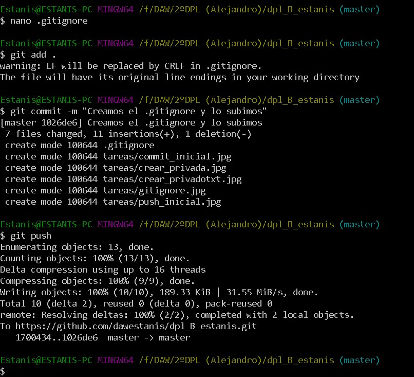
- touch 1.txt
> creamos el archivo 1.txt
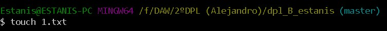
> Le hacemos un add . luego un commit y luego un push para enviar todos los cambios al repositorio.
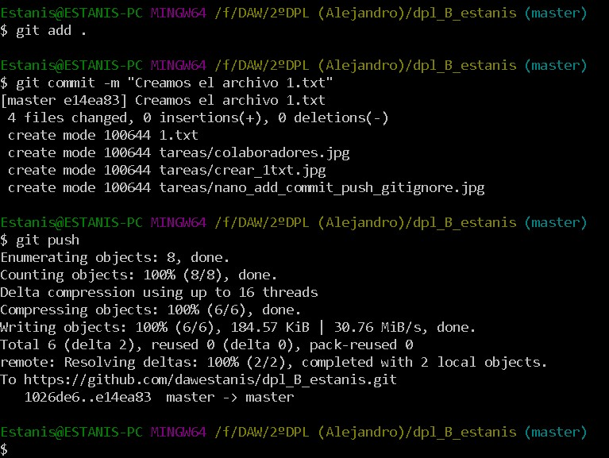
- git tag v0.1
> creamos el tag v0.1
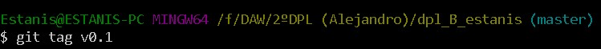
> realizamos el añadido con add, hacemos commit y push del tag.
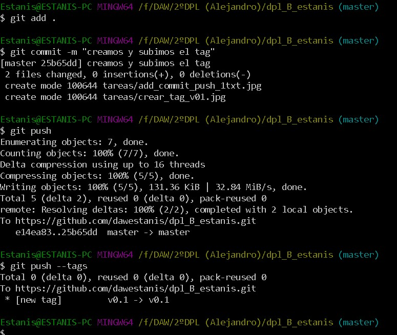
> Ahora realizaremos los pasos de la configuración y uso social del github.
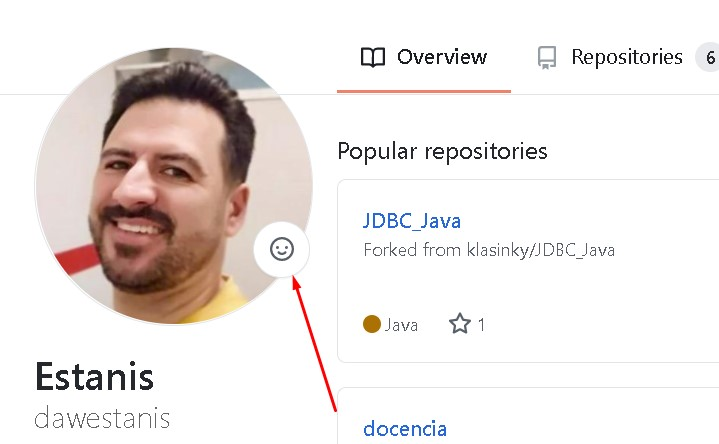
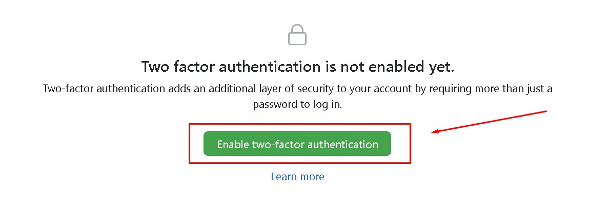
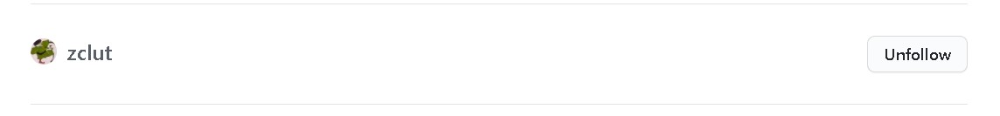
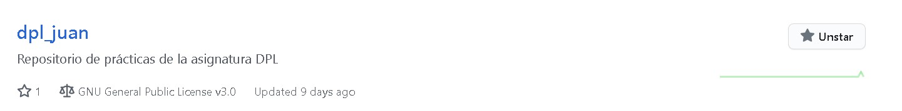
- - -
|**NOMBRE**|**GITHUB**|
| - - - | - - - |
| Juan Daniel|[github de Juan](https://github.com/zclut/dpl_juan)|
| - - - | - - - |
| Manu | [github de Manu](https://github.com/klasinky)|
| - - - | - - - |
| Romen | [github de Romen](https://github.com/romentoss/dpl_B_romen)|

> Añadimos a un colaborador.
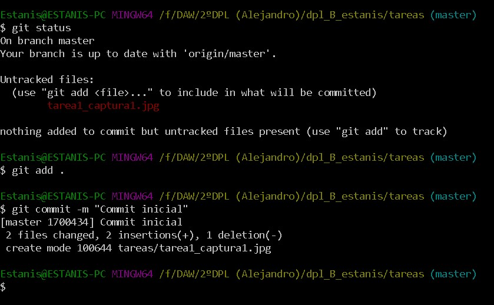

