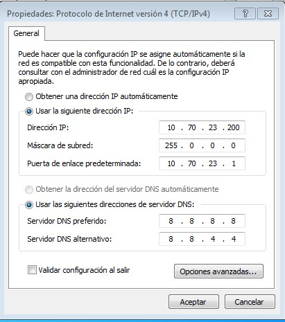
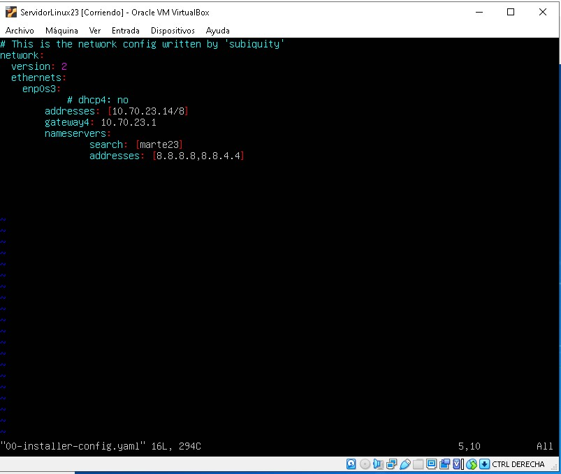
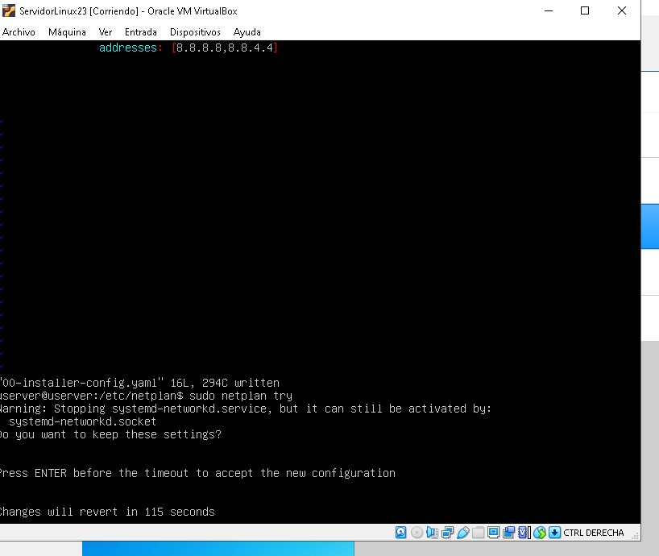
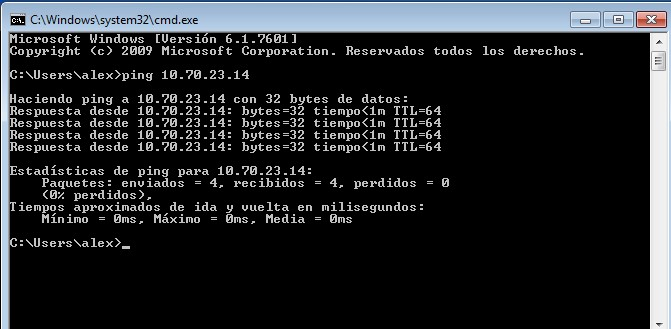

## Tarea 2.1

- Configuracíon del adaptador de red en VirtualBox
> Configuramos la red de ambas maquinas entrando a configuración desde el panel del virtualbox

|[DisplayVB](config_red_vb.jpg)

> Entramos en DesarrolloW723 para configuar la red.

- Configuración del adaptador de red en Ubuntu Server.
> Iniciamos la maquina virtual y vamos al directorio /etc/netplan/ y editamos el fichero 00-installer-config.yaml

> Ahora vamos a reiniciar configuración.

- Comprobación de la configuración y de funcionamiento.
> Ping desde Windows

