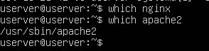
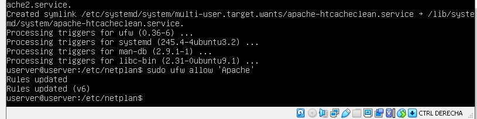
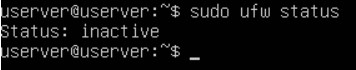
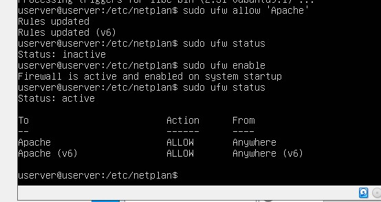
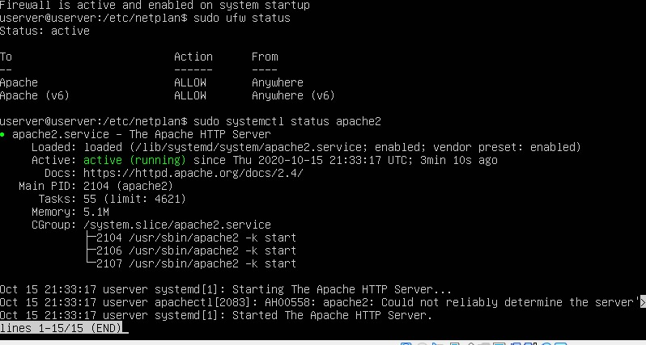
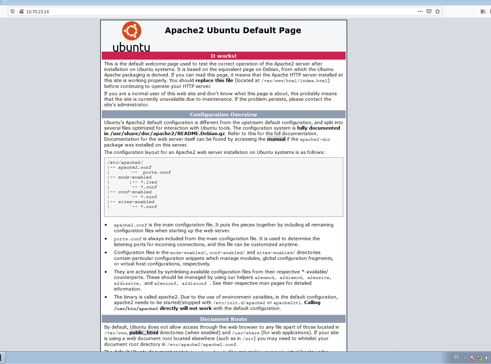

## Instalación del servidor web Apache en Ubuntu Server
- Instalar Apache
> Para instalar apache usaré el siguiente comando: `sudo apt install apache2`

> Vamos a comprobar que está instalado correctamente.

- Comfigurar el firewall.
> Se recomienda habilitar el perfil más restrictivo, que de todos modos permitirá el tráfico que configuró. Debido a que en esta práctica aún no configuramos SSL para nuestro servidor, solo deberemos permitir el tráfico en el puerto 80:

> Verificamos el cambio con el siguiente comando.

> Como no está activo tenemos que activar el firewall.

- Comprobar el estado del servidor web.
> Tras la instalación el Ubuntu inicia Apache. El servidor debe estar activo. Vamos a comprobarlo con el siguiente comando:

> Ahora tambien vamos a comprobarlo en un navegador.

