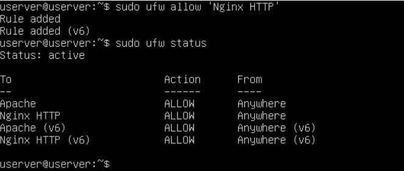
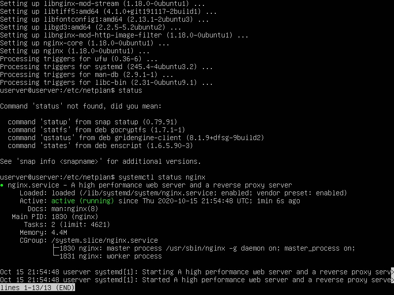
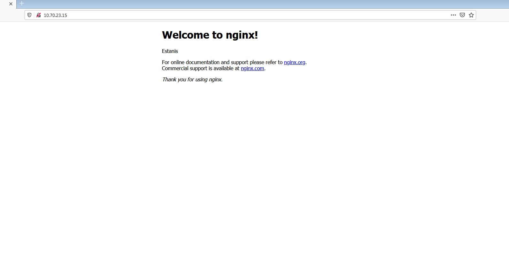

## Instalación del servidor web NGINX en Ubuntu Server
- Instalar Nginx
> Para instalar nginx vamos a usar el comando sudo `sudo apt install nginx`
> Comprobamos que se ha instalado

- Configurar el firewall.
> Se recomienda habilitar el perfil más restrictivo, que de todos modos permitirá el tráfico que configuró. En este momento, solo tendremos que permitir el tráfico en el puerto 80.

- Comprobar el estado del servidor web.
> Vamos a checkear que funciona de dos maneras el nginx.
> Voy a usar el comando `systemctl status nginx`

> Introducimos la ip del servidor en un navegador.

