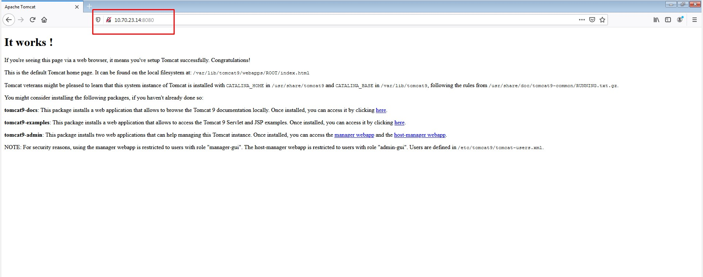
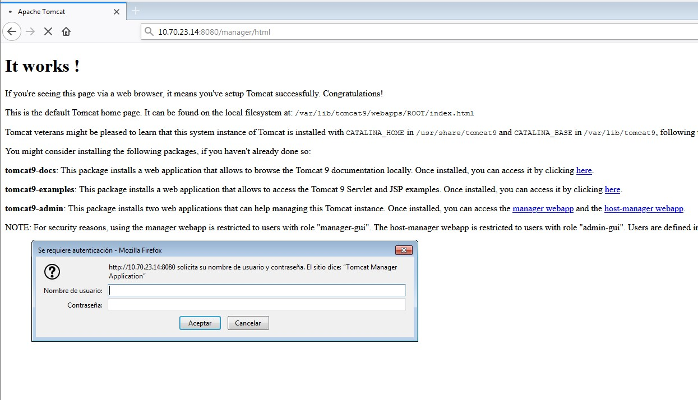
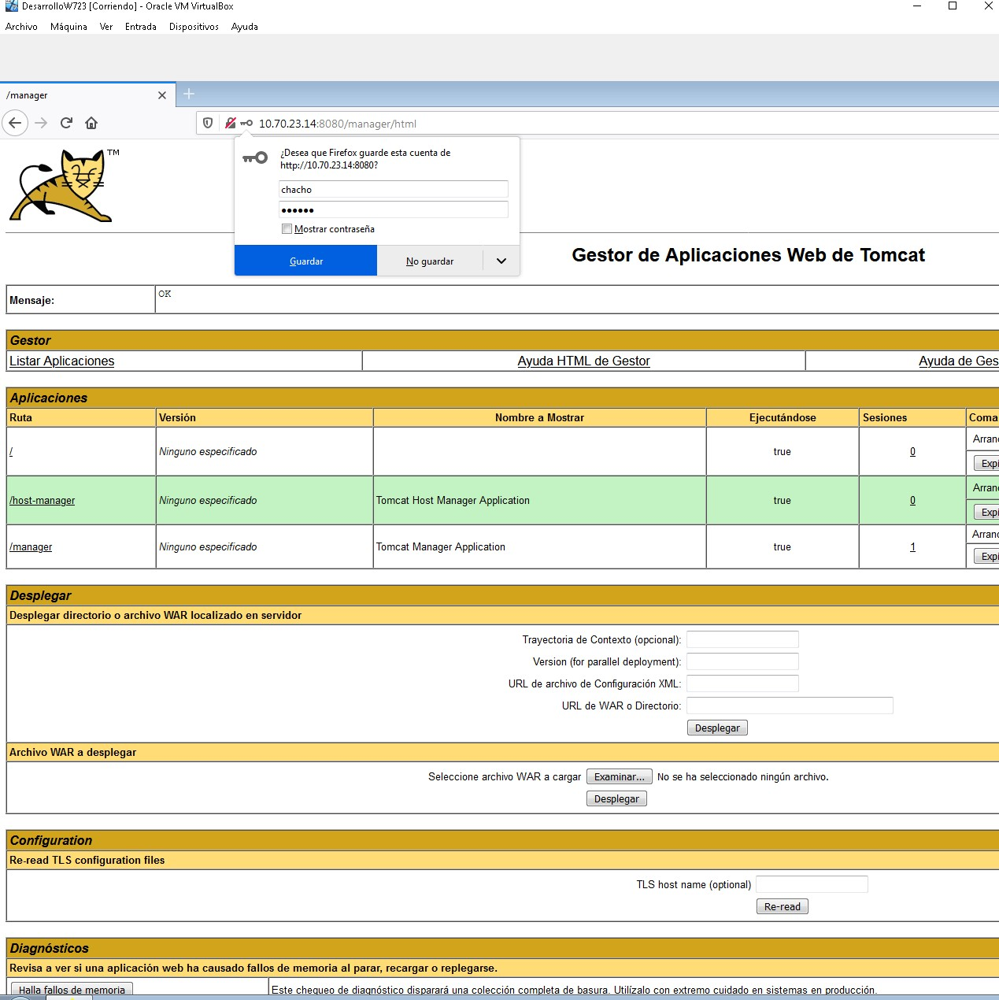
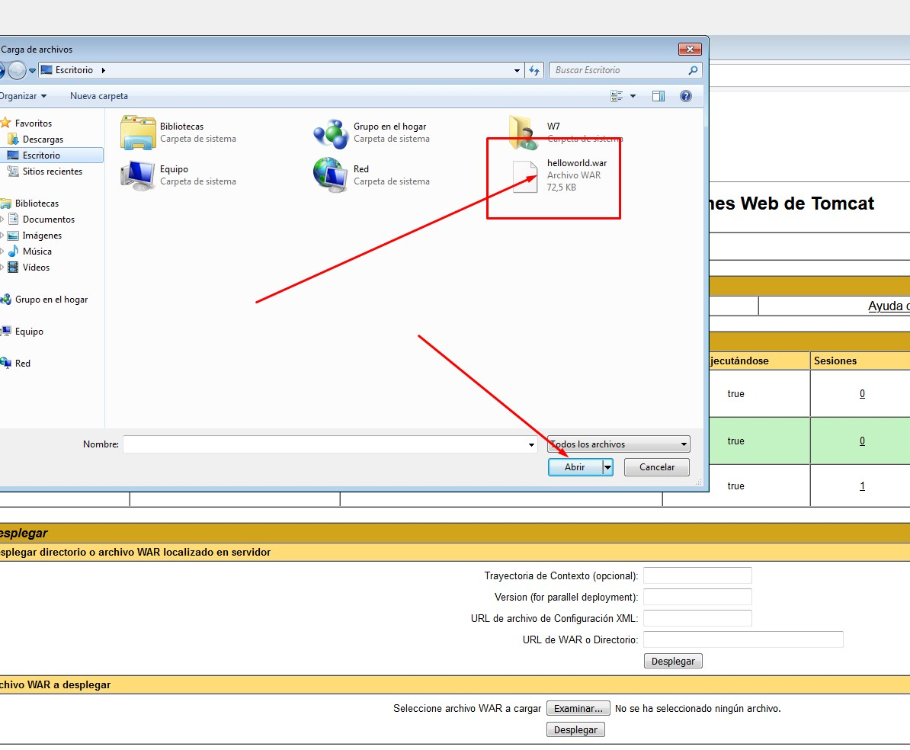
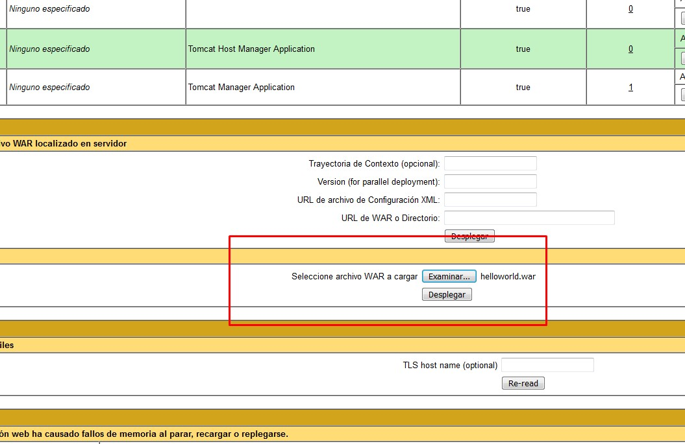
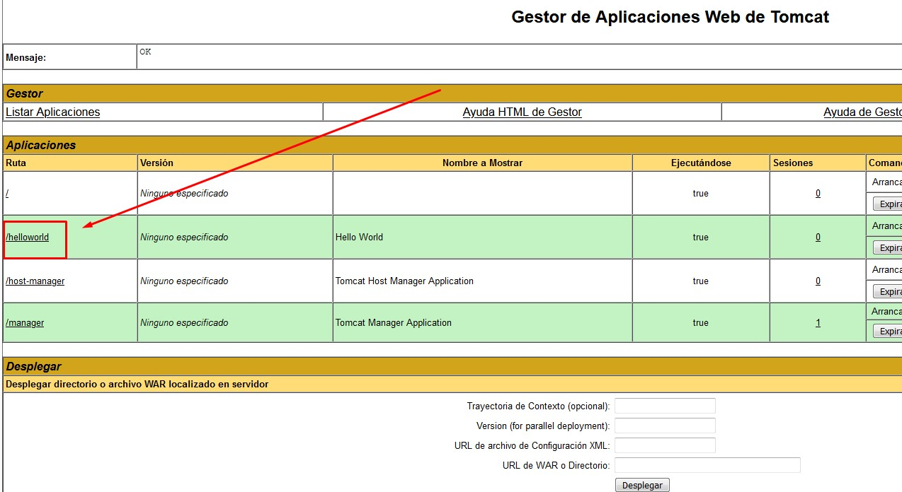
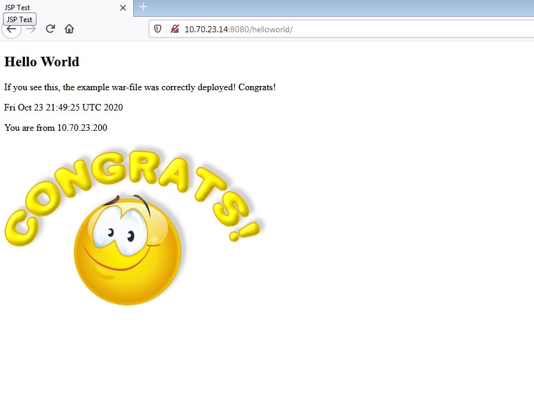
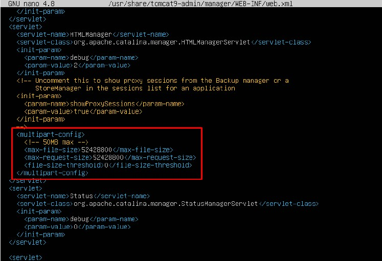
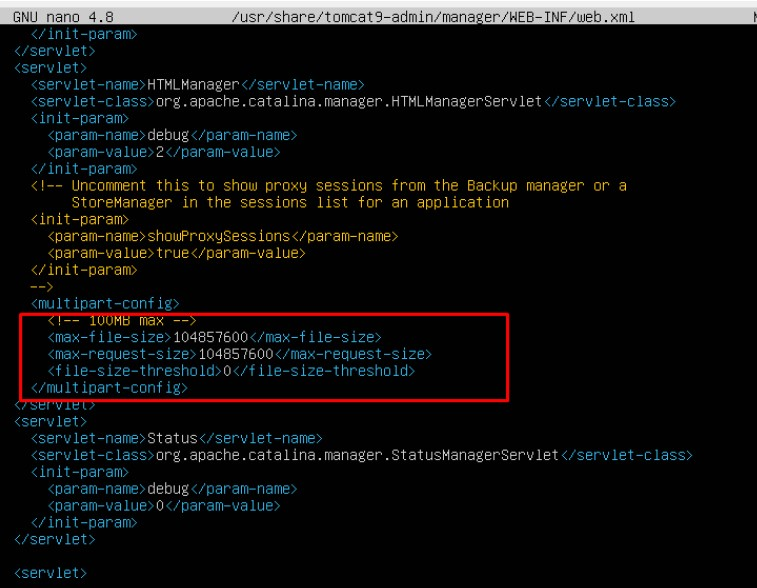

## Tarea 2.4 
### 1. Instalar Tomcat 9.

Vamos a instalar Tomcat 9 en Ubuntu 20.04 LTS desde los repositorios de la distribución, ya que la versión disponible es bastante reciente. Para ello actualizamos las listas de paquetes:
`sudo apt update`

Instalaremos los paquetes principales, correspondientes al núcleo de Tomcat y a las aplicaciones administrativas:

`sudo apt install -y tomcat9 tomcat9-admin`

Tras la instalación de Tomcat y sus dependencias se crea en Ubuntu 20.04 LTS el servicio tomcat9.service que queda en ejecución y habilitado para arrancar automáticamente junto al sistema.

### 2. Configurar el firewall.

Si vas a acceder a Tomcat 9 desde la red y tienes activado este firewall en Ubuntu 20.04 LTS, habrá que añadir una regla:
`sudo ufw allow 8080/tcp`

### 3. Configuración de Tomcat 9 en Ubuntu Server.
Vamos a configurar Tomcat 9 en Ubuntu 20.04 LTS antes de hacer ninguna prueba, ya que para trabajar con las aplicaciones administrativas no basta la configuración por defecto.

### 3.1 Puerto de conexión.
Por defecto, Tomcat 9 espera conexiones en el puerto 8080. El problema que podría surgir de esta configuración es que exista previamente otra aplicación utilizando dicho puerto, como un proxy, o que simplemente quieras usar un puerto distinto.

Podemos cambiar el puerto de escucha editando el archivo `server.xml`:

`sudo nano /etc/tomcat9/server.xml`

Buscaremos la siguiente directiva ***Conector:***

`...
    <Connector port="8080" protocol="HTTP/1.1"
               connectionTimeout="20000"
               redirectPort="8443" />
...`

Bastará con sustituir el valor de port por el puerto que queramos usar.

En este tutorial usaremos el puerto 8080, por lo que si decides cambiarlo debes tenerlo en cuenta a la hora de aplicar los ejemplos (y en la configuración del firewall).

### 3.2 Usuarios de Tomcat.
Algunas aplicaciones de Tomcat 9, como las aplicaciones administrativas, requieren el acceso autenticado de usuarios con cierto nivel de privilegios o roles.

Por ejemplo, el Gestor de Aplicaciones Web requiere usuarios con rol `manager-gui`, mientras que el Gestor de Máquina Virtual requiere el rol `admin-gui`.

Podemos crear los usuarios que consideremos con contraseña y con uno o ambos roles, en este caso será un solo usuario con ambos roles, para lo que editaremos el archivo `tomcat-users.xml`:

`sudo nano /etc/tomcat9/tomcat-users.xml`

Antes del cierre del bloque tomcat-users añadiremos una definición de usuario con contraseña y los roles necesarios:

`...
        <user username="chacho" password="XXXXXXXX" roles="admin-gui,manager-gui"/>
</tomcat-users>`

Guardamos los cambios y cerramos el archivo.

### 3.3 Acceso remoto a las aplicaciones.
Algunas aplicaciones, de nuevo entre ellas las aplicaciones administrativas, restringen en su configuración personal el acceso desde red, por lo que debemos editar su archivo de configuración `context.xml`. Son configuraciones de las aplicaciones en particular, no de Tomcat 9, y algunas aplicaciones tendrán esta característica y otras no.

En el caso del Gestor de Aplicaciones Web, o aplicación Manager, editamos su archivo `context.xml`:

`sudo nano /usr/share/tomcat9-admin/manager/META-INF/context.xml`

Dentro del bloque Context encontraremos una directiva Valve:
`
...
  <Valve className="org.apache.catalina.valves.RemoteAddrValve"
         allow="127\.\d+\.\d+\.\d+|::1|0:0:0:0:0:0:0:1" />
...
`
Debemos desactivar esta directiva encerrándola en un bloque de comentarios XML:

Comprobamos que funciona. Vamos a la maquina de Windows y ponemos la ip con :8080

### 3.4 Aplicando los cambios a la configuración.
Después de hacer estos cambios, habrá que reiniciar el servicio Tomcat 9 para aplicarlos:
sudo systemctl restart tomcat9

### 4. Acceder a Tomcat 9.
Vamos a acceder a Tomcat 9 en Ubuntu 20.04 LTS, desde un navegador, para lo que indicaremos la dirección IP o nombre de la máquina y el puerto de conexión, que en la configuración estándar es el 8080.

http://ip_del_server:8080

Obteniendo como resultado la página de inicio de Tomcat 9:

Hay varios enlaces a la aplicación de documentación, a la aplicación de ejemplos y a las aplicaciones administrativas.

### 5. Aplicación Manager.
Si intentamos acceder al Gestor de Aplicaiones Web, aplicación /manager/html, o http://ip_del_server:8080/manager/html en este ejemplo, sí que se nos solicita autenticación:

Introduciremos el nombre y la contraseña del usuario que creamos con el rol manager-gui para poder acceder, y se mostrará el Gestor de Aplicaciones Web de Tomcat, donde podrás desplegar, replegar, iniciar o detener aplicaciones web servidas desde Tomcat 9:

### 6. Aplicación Host Manager.
Desde la página inicial de Tomcat 9 encontraremos también el acceso al Gestor de Máquina Virtual de Tomcat en la ruta /host-manager, o http://ip_del_server:8080/host-manager/html en este ejemplo. Tras autenticarnos accederemos a la aplicación:

### 7. Desplegando aplicaciones sobre Tomcat 9 en Ubuntu Server.
Si dispones de un arhivo .war  (descargar el archivo adjunto a la tarea ) correspondiente a una aplicación que quieras desplegar en Tomcat 9 sobre Ubuntu, entra en el Gestor de Aplicaciones Web de Tomcat y desplázate hasta la sección Desplegar, concretamente al recuadro Archivo WAR a desplegar. Utilizando el botón Seleccionar archivo podrás buscar el archivo .war en el sistema de archivos.

Cuando el archivo esté seleccionado, pulsa el botón Desplegar. La aplicación será desplegada y se recargará el Gestor de Aplicaciones, la nueva aplicación aparecerá en la lista de aplicaciones, junto a sus controles de gestión:

Para probar la nueva aplicación bastará con seguir el enlace que aparece en la misma lista de aplicaciones, que será el enlace que facilitaremos a nuestros usuarios:

8. Cambiando el tamaño máximo admitido de los archivos .war

Es posible que para alguna aplicación en concreto no baste con el valor por defecto del tamaño máximo de archivos .war. Podremos aumentar este tamaño editando el archivo de configuración web.xml del Gestor de Aplicaciones Web de Tomcat:

sudo nano /usr/share/tomcat9-admin/manager/WEB-INF/web.xml

Buscamos el bloque multipart-config:

`...
    <multipart-config>
      <!-- 50MB max -->
      <max-file-size>52428800</max-file-size>
      <max-request-size>52428800</max-request-size>
      <file-size-threshold>0</file-size-threshold>
    </multipart-config>
...
´

Podemos comprobar que el tamaño máximo por defecto es de 50 MB estando las cantidades están expresadas en bytes. Por ejemplo, un nuevo tamaño máximo de 100 MB quedaría así:

`...
    <multipart-config>
      <!-- 100MB max -->
      <max-file-size>104857600</max-file-size>
      <max-request-size>104857600</max-request-size>
      <file-size-threshold>0</file-size-threshold>
    </multipart-config>
...
´

