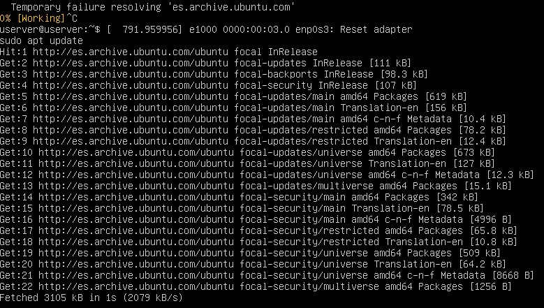
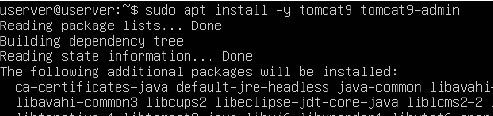
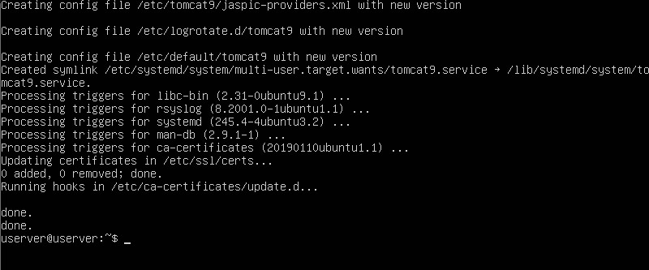
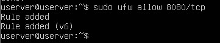
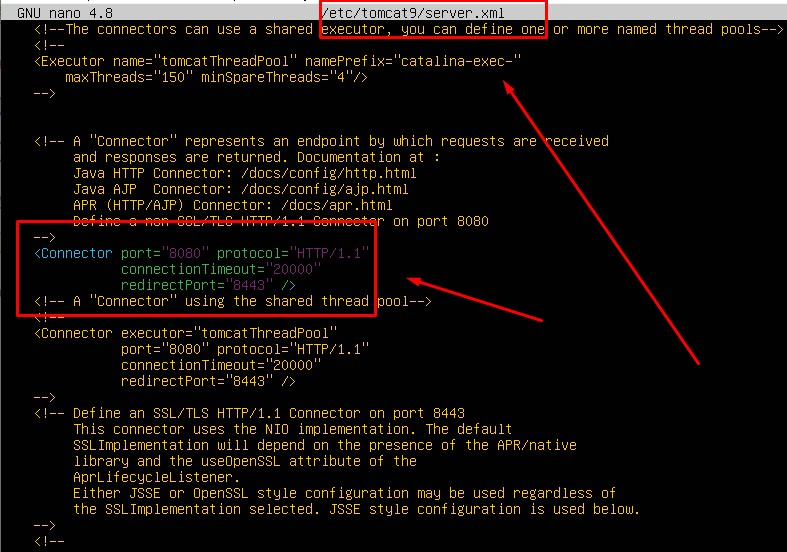
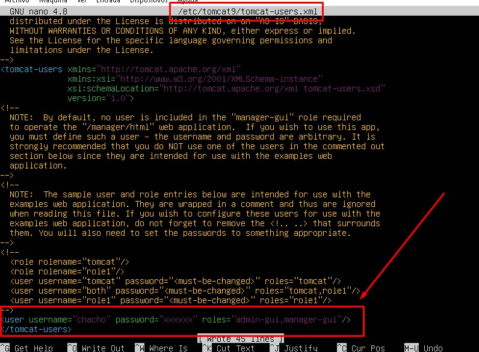
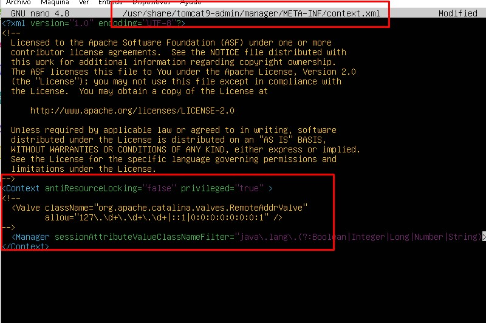
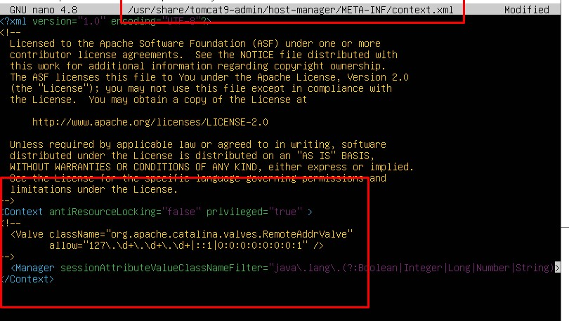
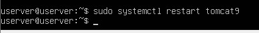
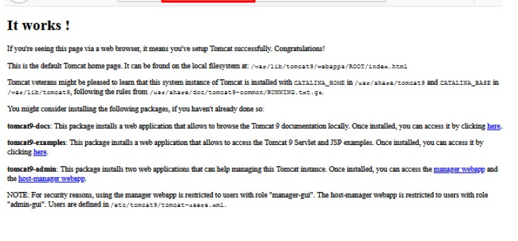

## Tarea 2.4 
### 1. Instalar Tomcat 9.

Vamos a instalar Tomcat 9 en Ubuntu 20.04 LTS desde los repositorios de la distribución, ya que la versión disponible es bastante reciente. Para ello actualizamos las listas de paquetes:
`sudo apt update`

Instalaremos los paquetes principales, correspondientes al núcleo de Tomcat y a las aplicaciones administrativas:

`sudo apt install -y tomcat9 tomcat9-admin`

Tras la instalación de Tomcat y sus dependencias se crea en Ubuntu 20.04 LTS el servicio tomcat9.service que queda en ejecución y habilitado para arrancar automáticamente junto al sistema.

### 2. Configurar el firewall.

Si vas a acceder a Tomcat 9 desde la red y tienes activado este firewall en Ubuntu 20.04 LTS, habrá que añadir una regla:
`sudo ufw allow 8080/tcp`

### 3. Configuración de Tomcat 9 en Ubuntu Server.
Vamos a configurar Tomcat 9 en Ubuntu 20.04 LTS antes de hacer ninguna prueba, ya que para trabajar con las aplicaciones administrativas no basta la configuración por defecto.

### 3.1 Puerto de conexión.
Por defecto, Tomcat 9 espera conexiones en el puerto 8080. El problema que podría surgir de esta configuración es que exista previamente otra aplicación utilizando dicho puerto, como un proxy, o que simplemente quieras usar un puerto distinto.

Podemos cambiar el puerto de escucha editando el archivo `server.xml`:

`sudo nano /etc/tomcat9/server.xml`

Buscaremos la siguiente directiva ***Conector:***

`...
    <Connector port="8080" protocol="HTTP/1.1"
               connectionTimeout="20000"
               redirectPort="8443" />
...`

Bastará con sustituir el valor de port por el puerto que queramos usar.

En este tutorial usaremos el puerto 8080, por lo que si decides cambiarlo debes tenerlo en cuenta a la hora de aplicar los ejemplos (y en la configuración del firewall).

### 3.2 Usuarios de Tomcat.
Algunas aplicaciones de Tomcat 9, como las aplicaciones administrativas, requieren el acceso autenticado de usuarios con cierto nivel de privilegios o roles.

Por ejemplo, el Gestor de Aplicaciones Web requiere usuarios con rol `manager-gui`, mientras que el Gestor de Máquina Virtual requiere el rol `admin-gui`.

Podemos crear los usuarios que consideremos con contraseña y con uno o ambos roles, en este caso será un solo usuario con ambos roles, para lo que editaremos el archivo `tomcat-users.xml`:

`sudo nano /etc/tomcat9/tomcat-users.xml`

Antes del cierre del bloque tomcat-users añadiremos una definición de usuario con contraseña y los roles necesarios:

`...
        <user username="chacho" password="XXXXXXXX" roles="admin-gui,manager-gui"/>
</tomcat-users>`

Guardamos los cambios y cerramos el archivo.

### 3.3 Acceso remoto a las aplicaciones.
Algunas aplicaciones, de nuevo entre ellas las aplicaciones administrativas, restringen en su configuración personal el acceso desde red, por lo que debemos editar su archivo de configuración `context.xml`. Son configuraciones de las aplicaciones en particular, no de Tomcat 9, y algunas aplicaciones tendrán esta característica y otras no.

En el caso del Gestor de Aplicaciones Web, o aplicación Manager, editamos su archivo `context.xml`:

`sudo nano /usr/share/tomcat9-admin/manager/META-INF/context.xml`

Dentro del bloque Context encontraremos una directiva Valve:
`
...
  <Valve className="org.apache.catalina.valves.RemoteAddrValve"
         allow="127\.\d+\.\d+\.\d+|::1|0:0:0:0:0:0:0:1" />
...
`
Debemos desactivar esta directiva encerrándola en un bloque de comentarios XML:

