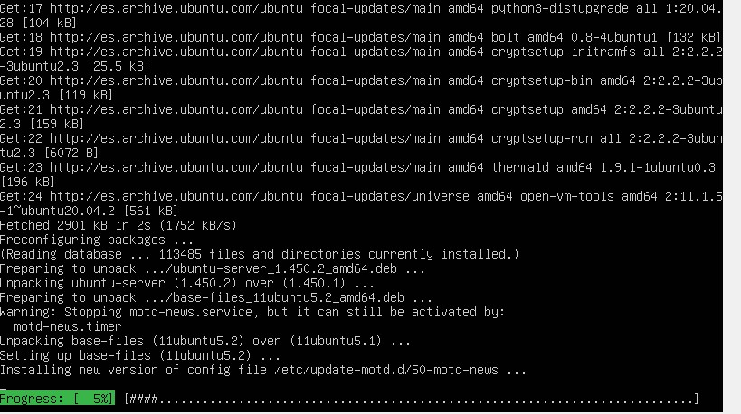
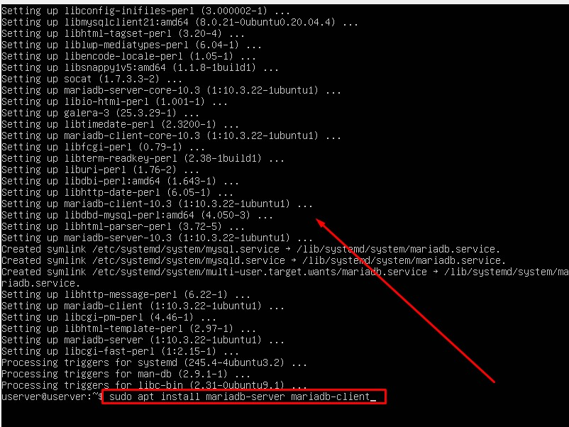
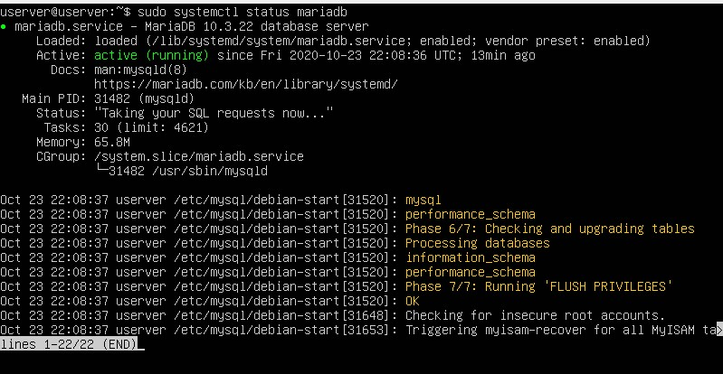
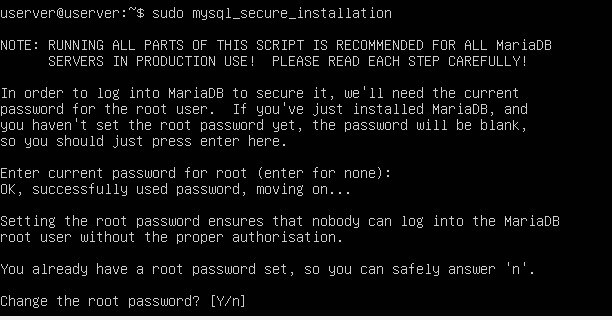
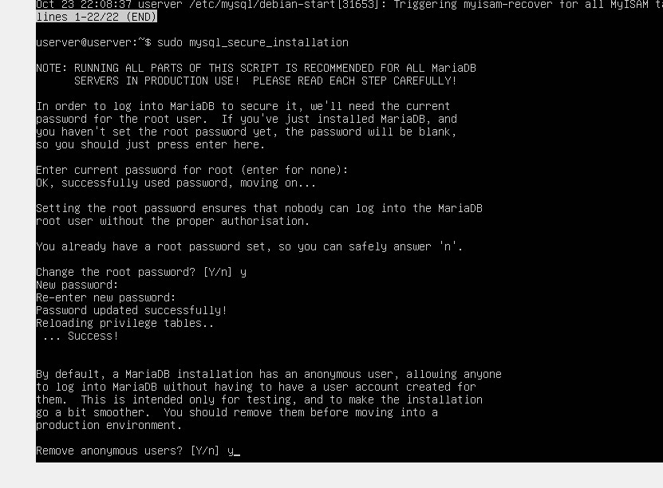
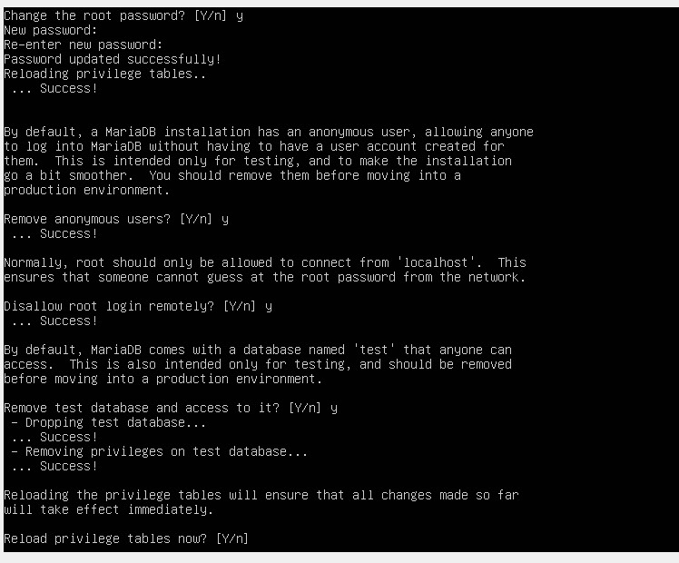
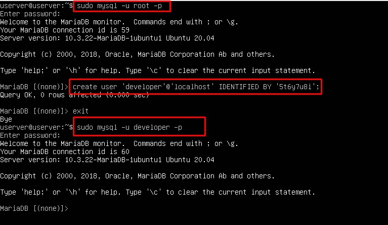
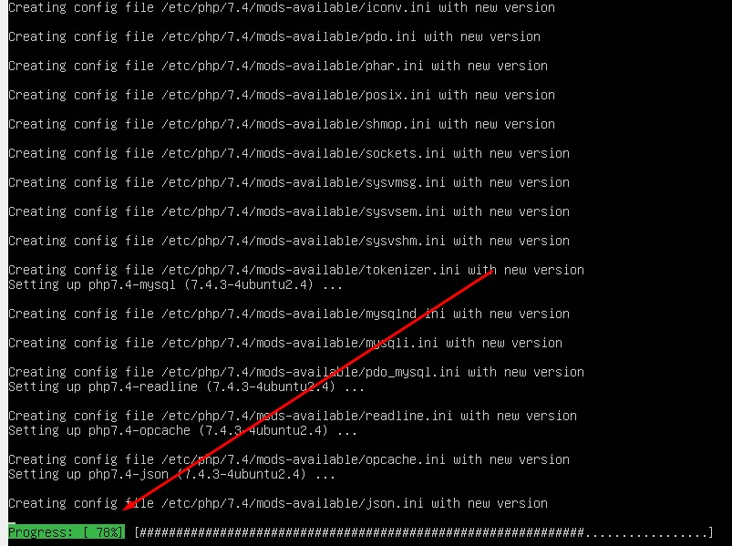
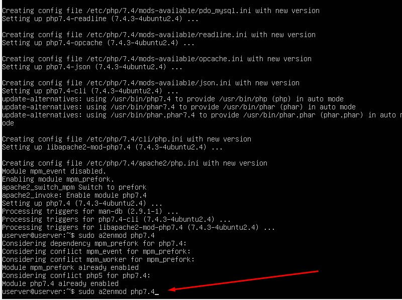
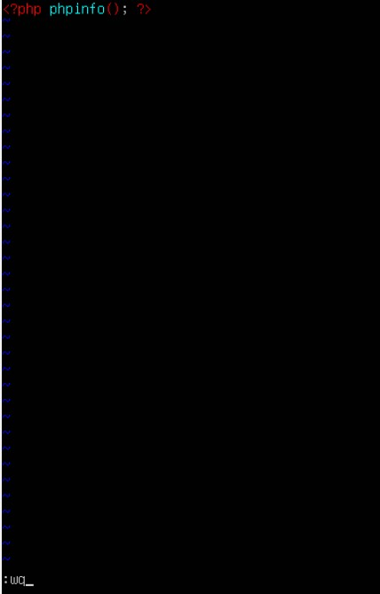

## Práctica 2.5- Instalación de LAMP en Ubuntu Server
### 1. Actualización del repositorio y paquetes.
`sudo apt update`

`sudo apt upgrade`

### 2.Instalación del servidor Apache

Realiza la instalación del servidor web Apache, tal y como vimos en la práctica anterior.

### 3. Instalación del servidor de base de datos MaríaDB

MariaDB es un reemplazo directo para MySQL. Escribe el siguiente comando para realizar la instalación:

`sudo apt install mariadb-server mariadb-client`

Después de que se instale, el servidor MariaDB debe ejecutarse automáticamente.

Inserta el comando utilizado para comprobar el estado del servidor y una captura de pantalla

`sudo systemctl status`

Para permitir que MariaDB se inicie automáticamente en el momento del arranque, debemos ejecutar:

`sudo systemctl enable mariadb`

Verifica la versión del servidor mariadb instalado:

Ejecutamos un script de seguridad posterior a la instalación, por medio del siguiente comando:

`sudo mysql_secure_installation`

Cuando nos solicite que escribamos la contraseña root de MariaDB, pulsa Introya que la contraseña root aún no está configurada. Después escribe tu contraseña de rootpara el servidor MariaDB.

A continuación podemos pulsar Intro para responder todas las preguntas restantes. Esto eliminará el usuario anónimo, deshabilitará el inicio de sesión raíz remoto y eliminará la base de datos de prueba.

Inserta capturas de pantalla de todo el proceso

Por defecto, el paquete MariaDB en Ubuntu usa unix_socket para autenticar el inicio de sesión del usuario.

Explica a que significa esto.

Prueba el acceso a la base de datos con la nueva contraseña.

Inserta  comando utilizado y captura de pantalla
Crea un nuevo usuario en la base de datos llamado developer con la contraseña 5t6y7u8i.

### 4.Instalación de la última versión de PHP.
Vamos a escribir el siguiente comando para instalar PHP y algunos módulos PHP comunes:

`sudo apt install php7.4 libapache2-mod-php7.4 php7.4-mysql php-common php7.4-cli php7.4-common php7.4-json php7.4-opcache php7.4-readline`

Ahora tendremos que activar el módulo Apache php8 y reiniciar el servidor web Apache.

`sudo a2enmod php7.4`

`sudo systemctl restart apache2`

Verificamos la versión de PHP instalada mediante el comando:

`php --version`

Para probar los scripts PHP con el servidor Apache, necesitamos crear un archivo info.php en el directorio raíz:

`sudo vim /var/www/html/info.php`

Dentro del archivo vamos a pegar el siguiente código PHP:

`<?php phpinfo(); ?>`

Una vez guardado el archivo, ahora en la barra de direcciones del navegador tendremos que escribir dirección-ip/info.php.

Inserta captura de pantalla del resultado

### 4.1 Ejecutando código PHP en Apache.

Tenemos dos formas de ejecutar código PHP con el servidor web Apache. Con el módulo PHP Apache y con PHP-FPM.7En los pasos anteriores, el módulo Apache PHP7.4 se usa para manejar el código PHP. Esto generalmente está bien, pero en algunos casos debemos ejecutar código PHP con PHP-FPM. Para hacerlo, tendremos que deshabilitar el módulo Apache PHP8:

`sudo a2dismod php7.4`

Posteriormente instalamos PHP-FPM:

`sudo apt install php7.4-fpm`

Continuamos habilitando proxy_fcgi y el módulo setenvif:

`sudo a2enmod proxy_fcgi setenvif`

El siguiente paso será habilitar el archivo de configuración /etc/apache2/conf-available/php7.4-fpm.conf:

`sudo a2enconf php7.4-fpm`

Después debemos reiniciar Apache:

`sudo systemctl restart apache2`

Ahora, si actualizas la página info.php en el navegador, encontrarás que la API del servidor ha cambiado de Apache 2.0 Handler a FPM/FastCGI, lo que significa que el servidor web Apache pasará las solicitudes de PHP a PHP-FPM.

Inserta   captura de pantalla
